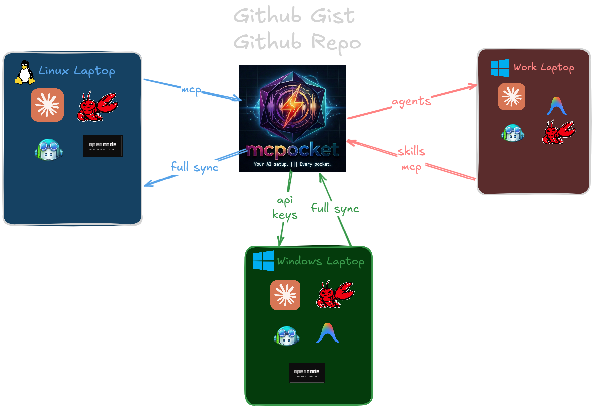

<p align="center">
  
  
  
</p>

<p align="center">
  
</p>

# mcpocket

> Your AI setup. Every pocket. ✨

**mcpocket** syncs your Claude Code agents, skills, plugins, and MCP server configurations across machines — so your full AI loadout follows you everywhere, like magic.

---

## The Problem

You install 8 MCP servers, configure your Claude Code plugins, and build up a library of agents on your Linux workstation. Then you switch to your Windows laptop and… nothing. You start from scratch. Again.

**mcpocket** fixes that with two commands: `push` from your source machine, `pull` on any other.

## How It Works

<p align="center">
  
</p>

mcpocket acts as a centralized sync hub for your AI setup. Push your configuration from any machine to GitHub (as a repo or gist), then pull it anywhere else. MCP servers, Claude Code agents, skills, plugins—everything syncs with end-to-end encryption for your secrets.

## Features

- **Multi-client sync** — Claude Desktop, Claude Code, OpenCode, Copilot CLI, Cursor, Codex, and Antigravity configs in one shot
- **Two storage backends** — private GitHub repo (full git history) or lightweight GitHub Gist
- **Provider-scoped sync** — target one or more providers with flags like `--copilot-cli` or `--opencode`
- **Project mode** — sync project-level AI config files (CLAUDE.md, .cursorrules, etc.) per-project with `--project`
- **End-to-end encryption** — secrets in MCP `env`, `headers`, and `http_headers` are encrypted with AES-256-GCM using a passphrase you choose
- **Cross-platform paths** — Windows ↔ Linux ↔ macOS paths round-trip seamlessly
- **Additive pull** — pulling merges remote servers into your local config without overwriting anything
- **De-duplicated file sync** — push/pull mirror synced files so stale agent, skill, and plugin files don't pile up
- **Zero dependencies on external services** — only GitHub and Git

---

## Install

```bash
npm install -g mcpocket
```

Or with pnpm / yarn:

```bash
pnpm add -g mcpocket
# or
yarn global add mcpocket
```

## Quick Start

```bash
# 1. Initialize (once per machine)
mcpocket init

# 2. Push your setup to the cloud
mcpocket push

# 3. Pull on a new machine
mcpocket pull

# 4. Clean up pocket files interactively
mcpocket cleanup

# 5. Clean up using patterns from your config (local only, no remote sync)
mcpocket cleanup --local

# 6. Clean up stale synced files if needed
mcpocket de-dupe

# 7. Check sync status
mcpocket status
```

### Project mode (per-project AI config files)

```bash
# Inside a project directory:

# 1. Initialize project tracking (creates mcpocket.json)
mcpocket init --project

# 2. Push project files (CLAUDE.md, .cursorrules, etc.) to your pocket
mcpocket push --project

# 3. Pull a project's files from your pocket into the current directory
mcpocket pull --project
```

---

## Commands

### `mcpocket init`

Interactive setup wizard. Links your GitHub account, chooses a storage backend, and creates the remote pocket.

```
$ mcpocket init

  ✦ First, let's link your GitHub account.
  Required scopes: repo (full control of private repositories)

  🔑 GitHub token: ****

  ✦ Authenticated as davidsmorais — nice to meet you!

  ✦ Where should mcpocket store your config?
      [1] GitHub repo  (private repo, full git history)
      [2] GitHub gist  (lighter, no git clone needed)

  Pick one [1/2]: 1
```

**Storage options:**

| Option | Backend | Requires Git? | History |
|---|---|---|---|
| `1` — Repo | Private `mcpocket-sync` repo | Yes | Full git log |
| `2` — Gist | Private GitHub Gist | No | Gist revisions |

Requires a [GitHub personal access token](https://github.com/settings/tokens/new) with **`repo`** scope (for repo mode) or **`gist`** scope (for gist mode).

### `mcpocket push`

Reads MCP configs, plugin manifests, agents, and skills from the current machine. Encrypts secrets with a passphrase you choose, then uploads to your private pocket.

```bash
mcpocket push
```

Target specific providers by passing one or more flags:

```bash
mcpocket push --copilot-cli
mcpocket push --cursor --codex
```

When provider flags are present, they scope the whole command:

- Only the selected providers' MCP configs are read and packed into `mcp-config.json`
- Claude home assets (`~/.claude/plugins`, `~/.claude/agents`, `~/.claude/skills`) are only synced when `--claude-code` is included

- In **repo mode**: commits and pushes to your private GitHub repo.
- In **gist mode**: uploads files to your private GitHub Gist (directory structure is flattened with `__` separators).

### `mcpocket pull`

Downloads your config from the remote pocket, decrypts secrets with your passphrase, and writes everything to the appropriate client config files:

```bash
mcpocket pull
```

You can also pull into only the providers you want:

```bash
mcpocket pull --opencode
mcpocket pull --cursor --copilot-cli
```

With provider flags, pull only writes MCP servers to those selected providers. Claude home assets are only restored when `--claude-code` is included.

| Client | Config file |
|---|---|
| Claude Desktop | `claude_desktop_config.json` |
| Claude Code | `~/.claude/settings.json` |
| OpenCode | `~/.config/opencode/config.json` |
| Copilot CLI | VS Code/Copilot user `mcp.json` |
| Cursor | `~/.cursor/mcp.json` |
| Codex | `~/.codex/config.toml` |
| Antigravity | `~/.gemini/antigravity/mcp_config.json` |

Pull is **additive** — it adds servers that exist remotely but not locally, without overwriting your existing local config. Restart Claude Desktop after pulling to apply MCP changes.

For synced files, pull also removes stale agent and skill files that were previously synced but no longer exist in your pocket.

### `mcpocket de-dupe`

Refreshes the pocket, mirrors the current synced files, removes stale duplicates on both sides, and writes the cleaned result back to your configured backend.

```bash
mcpocket de-dupe
```

Use this if you already have duplicate or renamed agent/skill/plugin files from earlier syncs. In normal use, `push` and `pull` now keep these folders de-duplicated automatically.

### `mcpocket cleanup`

Pulls your pocket from the remote, lets you interactively choose which files to keep, deletes the rest, then pushes the updated pocket back.

```bash
mcpocket cleanup
```

You will be presented with a numbered list of every file in your pocket and can enter comma-separated indices to select which ones to keep (pressing Enter keeps everything). After confirming, the unselected files are deleted and the pocket is pushed back to the remote.

**Options:**

| Flag | Description |
|---|---|
| `-l, --local` | Operate on the local pocket only — no pull/push; use patterns from `mcpocket.json` |
| `--dry-run` | Preview which files would be deleted without making any changes |
| `-y, --yes` | Skip the confirmation prompt |

#### Local-only cleanup (`--local`)

When running with `--local`, mcpocket reads `cleanupInclude` / `cleanupExclude` pattern arrays from `~/.mcpocket/config.json`:

```jsonc
{
  // ... other config ...
  "cleanupInclude": ["agents/", "skills/"],   // whitelist: only keep these
  "cleanupExclude": ["skills/nested/**"]       // blacklist: also remove these
}
```

Pattern semantics:
- `cleanupInclude`: only files matching **at least one** include pattern are kept. Omit or leave empty to include everything.
- `cleanupExclude`: files matching any exclude pattern are removed (applied after include filtering).
- `dir/` is shorthand for `dir/**` (matches all files inside that directory).
- `*` matches any characters within a single path segment; `**` matches across segments.

If no patterns are configured, `--local` falls back to the same interactive selection UI as the remote mode.

```bash
mcpocket cleanup --local
mcpocket cleanup --local --dry-run   # preview without deleting
mcpocket cleanup --local --yes       # skip confirmation
```

### `mcpocket status`

Shows a diff of what's synced, what's local-only, and what's remote-only:

```bash
mcpocket status
```

```
  ── MCP Servers ──

    Synced:
      ✓ filesystem
      ✓ github

    Local only (run push):
      ↑ sqlite

    In pocket, not here (run pull):
      ↓ postgres
```

---

## What Gets Synced

| Category | Source | Details |
|---|---|---|
| MCP server configs | Claude Desktop, Claude Code, OpenCode, Copilot CLI, Cursor, Codex, Antigravity | Merged across all selected providers |
| Plugin manifests | `~/.claude/plugins/` | `installed_plugins.json`, `blocklist.json`, `known_marketplaces.json` |
| Agents | `~/.claude/agents/` | All `*.md` files, recursively |
| Skills | `~/.claude/skills/` | All files, recursively (excluding `node_modules`) |

If you do not pass provider flags, `push` and `pull` operate on every supported provider. If you do pass flags, only those providers participate in the command.

### Never Synced

- `.credentials.json`
- `plugins/cache/`
- Sessions and telemetry data
- Your GitHub token (stays in local `~/.mcpocket/config.json`)

---

## Security

| Concern | How mcpocket handles it |
|---|---|
| API keys & tokens | Encrypted with **AES-256-GCM** (via `scrypt` key derivation) before leaving your machine |
| Passphrase storage | **Never stored** — you enter it on every push/pull |
| Remote storage | Always **private** (private repo or secret gist) |
| Local config | `~/.mcpocket/config.json` is `chmod 600` on Linux/macOS |
| Git auth | Token is injected at runtime into HTTPS URLs, never persisted in git config |
| Error output | Git errors are sanitized to strip tokens before display |

### Encryption Format

Encrypted values are stored as:

```
ENCRYPTED:<iv_hex>:<salt_hex>:<authTag_hex>:<ciphertext_hex>
```

Each value uses a unique random salt and IV, so identical plaintext values produce different ciphertexts.

---

## Path Handling

mcpocket normalizes paths for portability:

| Direction | Transformation |
|---|---|
| Push | `/home/user/...` or `C:\Users\user\...` → `~/...` |
| Pull | `~/...` → platform-native absolute path |
| Commands | `.cmd` / `.exe` extensions stripped on push, restored on pull (Windows) |

This means a config pushed from Linux works on Windows and vice versa.

---

## Configuration

mcpocket stores its own config at `~/.mcpocket/config.json`:

```jsonc
{
  "githubToken": "ghp_...",
  "storageType": "repo",       // "repo" or "gist"
  // Repo mode:
  "repoFullName": "user/mcpocket-sync",
  "repoCloneUrl": "https://github.com/user/mcpocket-sync.git",
  "repoHtmlUrl": "https://github.com/user/mcpocket-sync",
  // Gist mode:
  "gistId": "abc123...",
  "gistUrl": "https://gist.github.com/abc123...",
  // Cleanup patterns (used by `mcpocket cleanup --local`):
  "cleanupInclude": ["agents/", "skills/"],  // whitelist: only keep these
  "cleanupExclude": ["skills/nested/**"]      // blacklist: also remove these
}
```

The local repo clone (used as a staging area) lives at `~/.mcpocket/repo/`.

---

## Requirements

- **Node.js** 18+
- **Git** in PATH (repo mode only — gist mode doesn't need git)
- A **GitHub account** with a personal access token

---

## Project Structure

```
src/
  cli.ts              # Entry point, Commander setup
  config.ts           # Config read/write, storage type definitions
  clients/
    claude-desktop.ts  # Claude Desktop config reader/writer
    claude-code.ts     # Claude Code settings reader/writer
    opencode.ts        # OpenCode config reader/writer
    types.ts           # Shared MCP server type definitions
  commands/
    cleanup.ts         # Interactive/pattern-based pocket cleanup
    init.ts            # Interactive setup wizard
    push.ts            # Push local config to remote
    pull.ts            # Pull remote config to local
    status.ts          # Diff local vs. remote
  storage/
    github.ts          # GitHub repo CRUD + git operations
    gist.ts            # GitHub Gist CRUD + file flattening
  sync/
    agents.ts          # Agent file sync logic
    mcp.ts             # MCP server merge, pack/unpack, encrypt/decrypt
    plugins.ts         # Plugin manifest sync logic
    skills.ts          # Skills file sync logic
  utils/
    crypto.ts          # AES-256-GCM encrypt/decrypt helpers
    paths.ts           # Cross-platform path normalization
    prompt.ts          # Interactive CLI input helpers
    sparkle.ts         # CLI banners, spinners, and personality
```

---

## Troubleshooting

### "mcpocket is not initialized"

Run `mcpocket init` first to set up your GitHub connection and storage backend.

### "Decryption failed — wrong passphrase"

The passphrase you entered doesn't match the one used during `mcpocket push`. Passphrases are never stored — you need to remember the one you used.

### Push says "Nothing changed"

Your local config matches what's already in the remote pocket. No commit/upload needed.

### MCP servers not appearing after pull

Restart Claude Desktop to reload MCP server configurations. Claude Code and OpenCode pick up changes automatically.

### Git errors on push/pull (repo mode)

Make sure `git` is installed and in your PATH. If you see auth errors, your GitHub token may have expired — run `mcpocket init` to re-authenticate.

---

## Contributing

Contributions are welcome! Please open an issue or submit a pull request on [GitHub](https://github.com/davidsmorais/carry-on).

```bash
git clone https://github.com/davidsmorais/carry-on.git
cd carry-on
pnpm install
pnpm build
```

---

## Author

**David Morais** — [david@davidmorais.com](mailto:david@davidmorais.com)

- GitHub: [@davidsmorais](https://github.com/davidsmorais)

## License

[MIT](LICENSE) © David Morais
