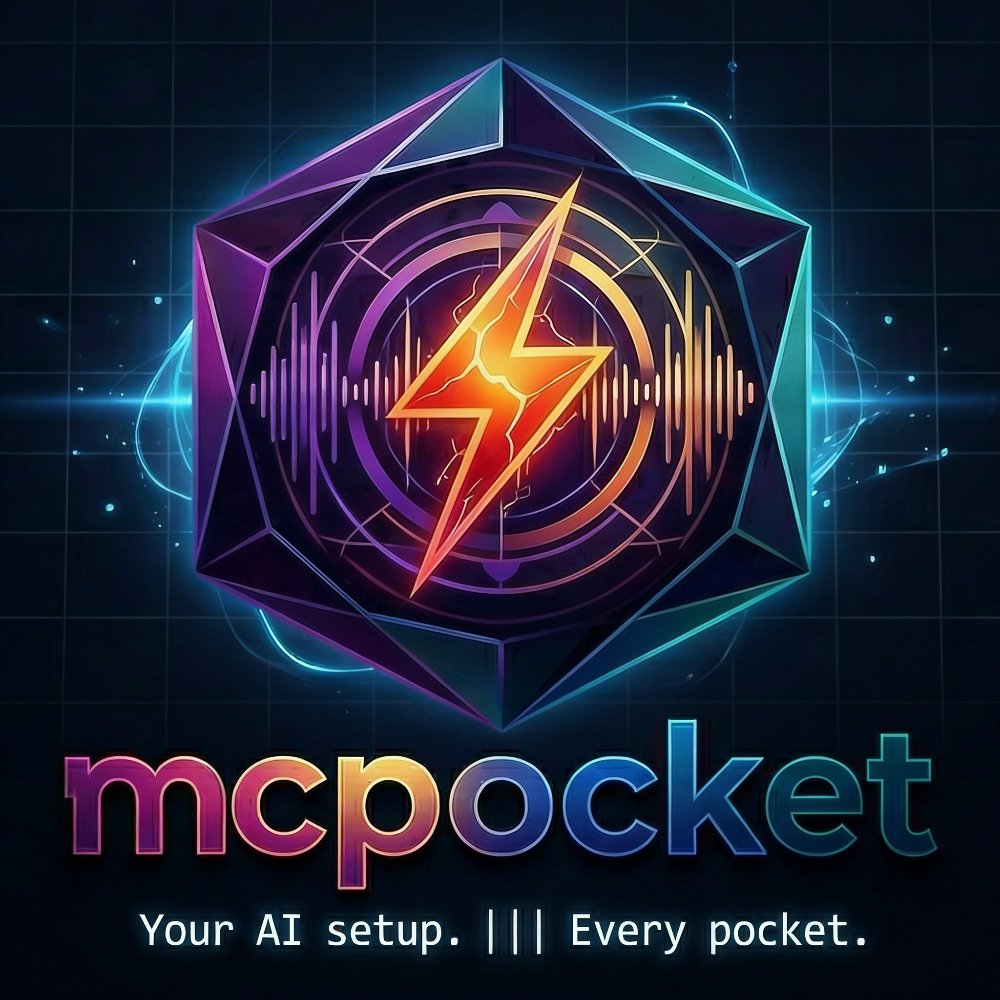
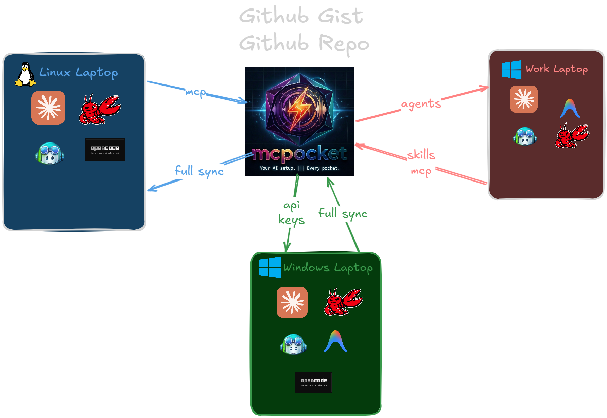

<p align="center">
  
  
  
</p>

<p align="center">
  
</p>

# mcpocket

> Your AI setup. Every pocket. ✨

**mcpocket** syncs your Claude Code agents, skills, plugins, and MCP server configurations across machines — so your full AI loadout follows you everywhere, like magic.

---

## The Problem

You install 8 MCP servers, configure your Claude Code plugins, and build up a library of agents on your Linux workstation. Then you switch to your Windows laptop and… nothing. You start from scratch. Again.

**mcpocket** fixes that with two commands: `push` from your source machine, `pull` on any other.

## How It Works

<p align="center">
  
</p>

mcpocket acts as a centralized sync hub for your AI setup. Push your configuration from any machine to GitHub (as a repo or gist), then pull it anywhere else. MCP servers, Claude Code agents, skills, plugins—everything syncs with end-to-end encryption for your secrets.

**What's new in this release**: Every push generates an **origin manifest** (`mcpocket.manifest.json`) inside your pocket that records where each file came from—which tool, which category (settings, agents, skills, plugins, MCPs, extensions), global vs. project scope, and the original file path. On pull, you choose where each file lands per-item, with smart defaults based on the manifest. No more guessing about scope or location—sync your full AI setup between machines with one confirmation pass.

## Features

- **Multi-client sync** — Claude Desktop, Claude Code, OpenCode, Copilot CLI, Cursor, Codex, and Gemini CLI configs in one shot
- **Two storage backends** — private GitHub repo (full git history) or lightweight GitHub Gist
- **Provider-scoped sync** — target one or more providers with flags like `--copilot-cli` or `--opencode`
- **Project mode** — sync project-level AI config files (CLAUDE.md, .cursorrules, etc.) per-project with `--project`
- **End-to-end encryption** — secrets in MCP `env`, `headers`, and `http_headers` are encrypted with AES-256-GCM using a passphrase you choose
- **Cross-platform paths** — Windows ↔ Linux ↔ macOS paths round-trip seamlessly
- **Additive pull** — pulling merges remote servers into your local config without overwriting anything
- **De-duplicated file sync** — push/pull mirror synced files so stale agent, skill, and plugin files don't pile up
- **Zero dependencies on external services** — only GitHub and Git

---

## Install

```bash
npm install -g mcpocket
```

Or with pnpm / yarn:

```bash
pnpm add -g mcpocket
# or
yarn global add mcpocket
```

## Quick Start

```bash
# 1. Initialize (once per machine)
mcpocket init

# 2. Push your setup to the cloud
mcpocket push

# 3. Pull on a new machine
mcpocket pull

# 4. Clean up pocket files interactively
mcpocket cleanup

# 5. Clean up using patterns from your config (local only, no remote sync)
mcpocket cleanup --local

# 6. Clean up stale synced files if needed
mcpocket de-dupe

# 7. Check sync status
mcpocket status
```

### Project mode (per-project AI config files)

```bash
# Inside a project directory:

# 1. Initialize project tracking (creates mcpocket.json)
mcpocket init --project

# 2. Push project files (CLAUDE.md, .cursorrules, etc.) to your pocket
mcpocket push --project

# 3. Pull a project's files from your pocket into the current directory
mcpocket pull --project
```

---

## Commands

### `mcpocket init`

Interactive setup wizard. Links your GitHub account via the GitHub CLI, chooses a storage backend, and creates (or connects to) the remote sync pocket.

```
$ mcpocket init

  ✦ Linking your GitHub account via the GitHub CLI...

  ✦ Authenticated as davidsmorais — nice to meet you!

  ✦ Where should mcpocket store your config?
      [1] GitHub repo  (private repo, full git history)
      [2] GitHub gist  (lighter, no git clone needed)

  Pick one [1/2]: 1

  ✦ Do you have an existing pocket to connect? [y/N]
  [If yes, select from your repositories or gists]

  ✦ Pocket ready: https://github.com/davidsmorais/mcpocket-sync
```

**Storage options:**

| Option | Backend | Requires Git? | History |
|---|---|---|---|
| `1` — Repo | Private `mcpocket-sync` repo | Yes | Full git log |
| `2` — Gist | Private GitHub Gist | No | Gist revisions |

**Authentication**: mcpocket uses the GitHub CLI for authentication. Ensure `gh auth login` is set up first.

**Note**: The sync scope (which tools, categories, and items) is chosen per-run during `push` and `pull` via the hierarchical tree picker and per-item destination chooser. Init no longer asks you to pre-select categories or providers.

### `mcpocket push`

**New in this release**: Shows a hierarchical picker (organized by AI tool, scope, and category) so you choose exactly what to sync. Every push generates an **origin manifest** (`mcpocket.manifest.json`) that records where each file came from—tool, category, global vs. project, and original path. This manifest travels with your pocket so the destination machine knows exactly where to restore each file.

Reads MCP configs, plugin manifests, agents, skills, settings, and extensions from the current machine. Encrypts secrets with a passphrase you choose, then uploads to your private pocket.

```bash
mcpocket push
```

**Options:**

| Flag | Description |
|---|---|
| `--all` | Skip the picker and sync everything (CI / scripted use) |
| `--project` | Also include project-level files from this directory |
| `--claude-code`, `--copilot-cli`, etc. | Scope MCP server sync to specific providers |

The interactive picker shows:
- **Tool** (Claude, Copilot, OpenCode, Gemini)
- **Scope** (GLOBAL — from home dir, or project-name — from project folder)
- **Category** (Settings, Agents, Skills, Plugins, Extensions, MCPs)
- **Items** (individual files or skill directories)

Toggle items with **space**, select all with **a**, and press **Enter** to push.

- In **repo mode**: commits and pushes to your private GitHub repo.
- In **gist mode**: uploads files to your private GitHub Gist (directory structure is flattened with `__` separators).

**Legacy alias**: `-i/--interactive` still works and invokes the same tree picker (it's now the default, not an opt-in).

### `mcpocket pull`

**New in this release**: Reads the origin manifest from your pocket and shows a per-item destination chooser. Each file gets a smart default destination based on where it came from (e.g., a Claude skill from your global settings goes back to `~/.claude/skills/`), and you can override per-item or globally with a flag.

Downloads your config from the remote pocket, decrypts secrets with your passphrase, and writes everything to the appropriate client config files:

```bash
mcpocket pull
```

**Options:**

| Flag | Description |
|---|---|
| `-y, --yes` | Accept all proposed destinations without prompting (non-interactive) |
| `--project` | Force all files to land under the current project directory |
| `--global` | Force all files to land in global home-dir locations (default) |
| `--claude-code`, `--copilot-cli`, etc. | Scope MCP server pull to specific providers |

The **per-item destination chooser** shows:
1. **Which files to restore** — multi-select the items you want (default: all)
2. **Where each item goes** — for each selected item, confirm or override the proposed destination (default from manifest origin):
   - File from `~/.claude/agents/` → proposes `~/.claude/agents/` on destination machine
   - File from `./.claude/agents/` (project) → proposes `./.claude/agents/` (project) on destination machine
   - Override options available to switch between global and project scope

You can accept all proposals with `-y/--yes` for scripting:
```bash
mcpocket pull --yes
```

Or force everything to the current project:
```bash
mcpocket pull --project
```

| Client | Config file |
|---|---|
| Claude Desktop | `claude_desktop_config.json` |
| Claude Code | `~/.claude/settings.json` |
| OpenCode | `~/.config/opencode/config.json` |
| Copilot CLI | VS Code/Copilot user `mcp.json` (push also reads `~/.copilot/mcp-config.json`) |
| Cursor | `~/.cursor/mcp.json` |
| Codex | `~/.codex/config.toml` |
| Gemini CLI | `~/.gemini/settings.json` |

Pull is **additive** — it adds servers that exist remotely but not locally, without overwriting your existing local config. Restart Claude Desktop after pulling to apply MCP changes.

For synced files, pull also removes stale agent and skill files that were previously synced but no longer exist in your pocket.

**Legacy alias**: `-i/--interactive` still works and invokes the same per-item chooser (it's now the default, not an opt-in).

### `mcpocket de-dupe`

Refreshes the pocket, mirrors the current synced files, removes stale duplicates on both sides, and writes the cleaned result back to your configured backend.

```bash
mcpocket de-dupe
```

Use this if you already have duplicate or renamed agent/skill/plugin files from earlier syncs. In normal use, `push` and `pull` now keep these folders de-duplicated automatically.

### `mcpocket cleanup`

Pulls your pocket from the remote, lets you interactively choose which files to keep, deletes the rest, then pushes the updated pocket back.

```bash
mcpocket cleanup
```

You will be presented with a numbered list of every file in your pocket and can enter comma-separated indices to select which ones to keep (pressing Enter keeps everything). After confirming, the unselected files are deleted and the pocket is pushed back to the remote.

**Options:**

| Flag | Description |
|---|---|
| `-l, --local` | Operate on the local pocket only — no pull/push; use patterns from `mcpocket.json` |
| `--dry-run` | Preview which files would be deleted without making any changes |
| `-y, --yes` | Skip the confirmation prompt |

#### Local-only cleanup (`--local`)

When running with `--local`, mcpocket reads `cleanupInclude` / `cleanupExclude` pattern arrays from `~/.mcpocket/config.json`:

```jsonc
{
  // ... other config ...
  "cleanupInclude": ["agents/", "skills/"],   // whitelist: only keep these
  "cleanupExclude": ["skills/nested/**"]       // blacklist: also remove these
}
```

Pattern semantics:
- `cleanupInclude`: only files matching **at least one** include pattern are kept. Omit or leave empty to include everything.
- `cleanupExclude`: files matching any exclude pattern are removed (applied after include filtering).
- `dir/` is shorthand for `dir/**` (matches all files inside that directory).
- `*` matches any characters within a single path segment; `**` matches across segments.

If no patterns are configured, `--local` falls back to the same interactive selection UI as the remote mode.

```bash
mcpocket cleanup --local
mcpocket cleanup --local --dry-run   # preview without deleting
mcpocket cleanup --local --yes       # skip confirmation
```

### `mcpocket status`

Shows a diff of what's synced, what's local-only, and what's remote-only:

```bash
mcpocket status
```

```
  ── MCP Servers ──

    Synced:
      ✓ filesystem
      ✓ github

    Local only (run push):
      ↑ sqlite

    In pocket, not here (run pull):
      ↓ postgres
```

---

## What Gets Synced

| Category | Source | Details |
|---|---|---|
| MCP server configs | Claude Desktop, Claude Code, OpenCode, Copilot CLI, Cursor, Codex, Gemini CLI | Merged across all selected providers |
| Plugin manifests | `~/.claude/plugins/` | `installed_plugins.json`, `blocklist.json`, `known_marketplaces.json` |
| Agents | `~/.claude/agents/`, `~/.copilot/agents/`, and `~/.gemini/agents/` | All `*.md` files, recursively; merged from all sources — Claude wins on conflict |
| Skills | `~/.claude/skills/` and `~/.gemini/skills/` | All files, recursively (excluding `node_modules`); merged from both sources — Claude wins on conflict |

If you do not pass provider flags, `push` and `pull` operate on every supported provider. If you do pass flags, only those providers participate in the command.

### Multi-source agents and skills

On push, agents are collected from `~/.claude/agents/`, `~/.copilot/agents/`, and `~/.gemini/agents/`, and skills from `~/.claude/skills/` and `~/.gemini/skills/`. Files from these sources are merged into a single pocket. When the same filename exists in multiple source directories, the Claude home directory (`~/.claude/`) takes precedence. On pull, provider-scoped files are restored to their matching directories (`~/.claude/...`, `~/.copilot/...`, and `~/.gemini/...`).

### Never Synced

- `.credentials.json`
- `plugins/cache/`
- Sessions and telemetry data
- Your GitHub token (stays in local `~/.mcpocket/config.json`)

---

## Security

| Concern | How mcpocket handles it |
|---|---|
| API keys & tokens | Encrypted with **AES-256-GCM** (via `scrypt` key derivation) before leaving your machine |
| Passphrase storage | **Never stored** — you enter it on every push/pull |
| Remote storage | Always **private** (private repo or secret gist) |
| Local config | `~/.mcpocket/config.json` is `chmod 600` on Linux/macOS |
| Git auth | Token is injected at runtime into HTTPS URLs, never persisted in git config |
| Error output | Git errors are sanitized to strip tokens before display |

### Encryption Format

Encrypted values are stored as:

```
ENCRYPTED:<iv_hex>:<salt_hex>:<authTag_hex>:<ciphertext_hex>
```

Each value uses a unique random salt and IV, so identical plaintext values produce different ciphertexts.

---

## Path Handling

mcpocket normalizes paths for portability:

| Direction | Transformation |
|---|---|
| Push | `/home/user/...` or `C:\Users\user\...` → `~/...` |
| Pull | `~/...` → platform-native absolute path |
| Commands | `.cmd` / `.exe` extensions stripped on push, restored on pull (Windows) |

This means a config pushed from Linux works on Windows and vice versa.

---

## Configuration

mcpocket stores its own config at `~/.mcpocket/config.json`:

```jsonc
{
  "githubToken": "ghp_...",
  "storageType": "repo",       // "repo" or "gist"
  // Repo mode:
  "repoFullName": "user/mcpocket-sync",
  "repoCloneUrl": "https://github.com/user/mcpocket-sync.git",
  "repoHtmlUrl": "https://github.com/user/mcpocket-sync",
  // Gist mode:
  "gistId": "abc123...",
  "gistUrl": "https://gist.github.com/abc123...",
  // Cleanup patterns (used by `mcpocket cleanup --local`):
  "cleanupInclude": ["agents/", "skills/"],  // whitelist: only keep these
  "cleanupExclude": ["skills/nested/**"]      // blacklist: also remove these
  // NOTE: syncCategories, syncProviders, syncAgents, syncSkills, syncPlugins
  // are deprecated — sync scope is now determined per-run via the tree picker
  // (push) and per-item destination chooser (pull).
}
```

The local repo clone (used as a staging area) lives at `~/.mcpocket/repo/`.

---

## Requirements

- **Node.js** 18+
- **Git** in PATH (repo mode only — gist mode doesn't need git)
- A **GitHub account** with a personal access token

---

## Project Structure

```
src/
  cli.ts              # Entry point, Commander setup
  config.ts           # Config read/write, storage type definitions
  clients/
    claude-desktop.ts  # Claude Desktop config reader/writer
    claude-code.ts     # Claude Code settings reader/writer
    opencode.ts        # OpenCode config reader/writer
    types.ts           # Shared MCP server type definitions
  commands/
    cleanup.ts         # Interactive/pattern-based pocket cleanup
    init.ts            # Interactive setup wizard
    push.ts            # Push local config to remote
    pull.ts            # Pull remote config to local
    status.ts          # Diff local vs. remote
  storage/
    github.ts          # GitHub repo CRUD + git operations
    gist.ts            # GitHub Gist CRUD + file flattening
  sync/
    agents.ts          # Agent file sync logic
    mcp.ts             # MCP server merge, pack/unpack, encrypt/decrypt
    plugins.ts         # Plugin manifest sync logic
    skills.ts          # Skills file sync logic
  utils/
    crypto.ts          # AES-256-GCM encrypt/decrypt helpers
    paths.ts           # Cross-platform path normalization
    prompt.ts          # Interactive CLI input helpers
    sparkle.ts         # CLI banners, spinners, and personality
```

---

## Troubleshooting

### "mcpocket is not initialized"

Run `mcpocket init` first to set up your GitHub connection and storage backend.

### "Decryption failed — wrong passphrase"

The passphrase you entered doesn't match the one used during `mcpocket push`. Passphrases are never stored — you need to remember the one you used.

### Push says "Nothing changed"

Your local config matches what's already in the remote pocket. No commit/upload needed.

### MCP servers not appearing after pull

Restart Claude Desktop to reload MCP server configurations. Claude Code and OpenCode pick up changes automatically.

### Git errors on push/pull (repo mode)

Make sure `git` is installed and in your PATH. If you see auth errors, your GitHub token may have expired — run `mcpocket init` to re-authenticate.

---

## Contributing

Contributions are welcome! Please open an issue or submit a pull request on [GitHub](https://github.com/davidsmorais/carry-on).

```bash
git clone https://github.com/davidsmorais/carry-on.git
cd carry-on
pnpm install
pnpm build
```

---

## Author

**David Morais** — [david@davidmorais.com](mailto:david@davidmorais.com)

- GitHub: [@davidsmorais](https://github.com/davidsmorais)

## License

[MIT](LICENSE) © David Morais
